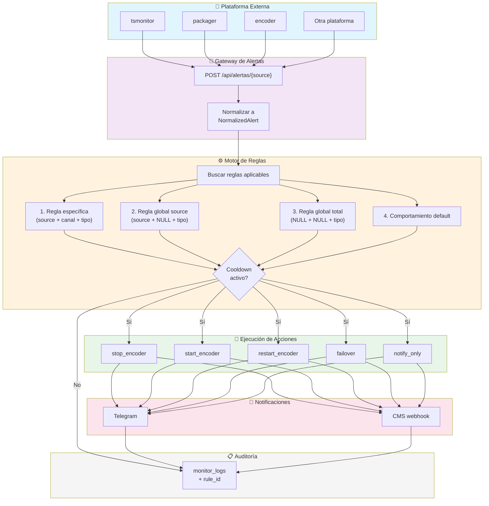
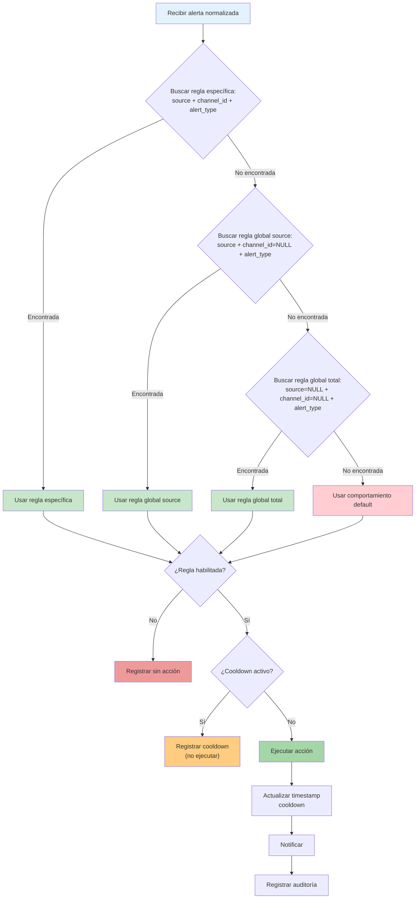
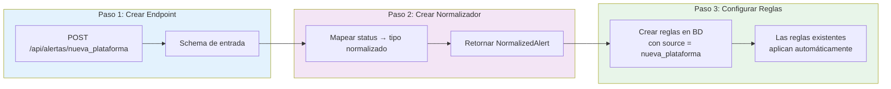

# Diagrama de Flujo — Sistema de Reglas para Alertas Externas

## Flujo Principal



## Flujo de Búsqueda de Reglas



## Integración de Nueva Plataforma



## Acciones Disponibles

| Acción | Descripción | Endpoint Agente |
|--------|-------------|-----------------|
| `stop_encoder` | Detiene el encoder del canal | `POST /jobs/control?action=stop` |
| `start_encoder` | Inicia el encoder del canal | `POST /jobs/create` |
| `restart_encoder` | Reinicia el encoder (stop + start) | `POST /jobs/control?action=restart` |
| `failover` | Activa failover a señal de respaldo | `POST /api/internal/trigger-failover/{id}` |
| `notify_only` | Solo registra log y notifica | (sin acción en encoder) |

## Prioridad de Reglas

```
1. Regla específica (source + channel_id + alert_type)
   ↓ no encontrada
2. Regla global source (source + channel_id=NULL + alert_type)
   ↓ no encontrada
3. Regla global total (source=NULL + channel_id=NULL + alert_type)
   ↓ no encontrada
4. Comportamiento por defecto (hardcodeado)
```
